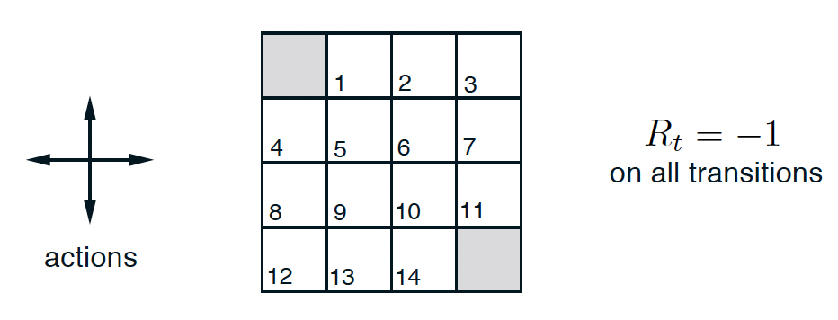
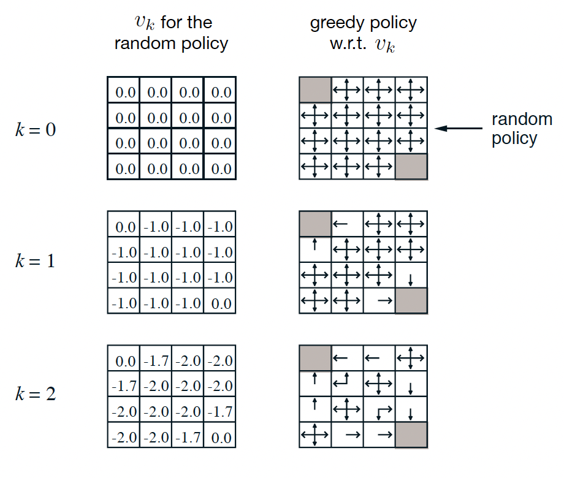
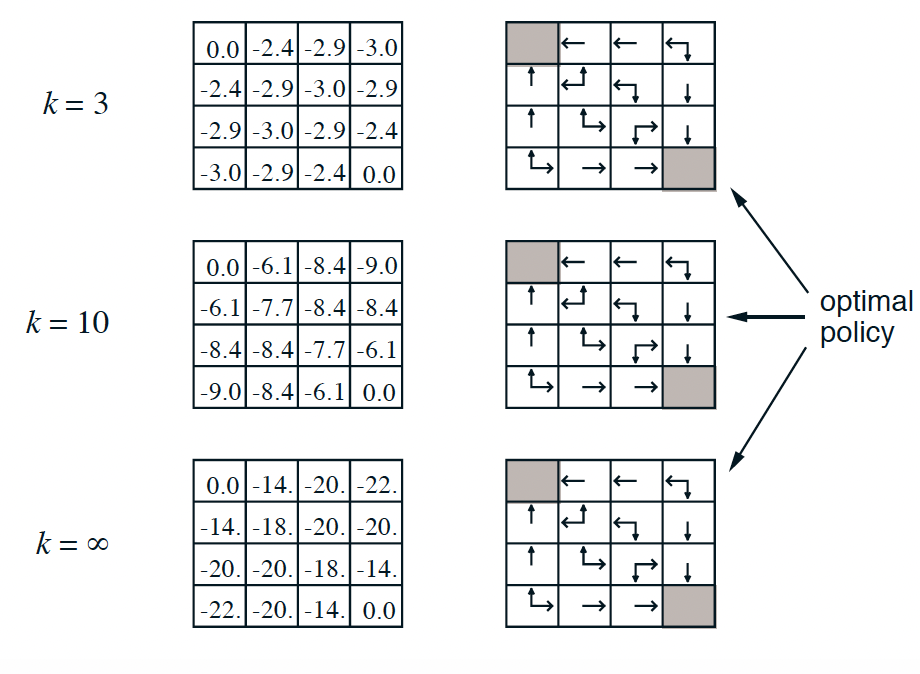

# Reinforcement Learning <br> (DSAI 402)
## Lecture 4

Mohamed Ghalwash
<Email v="mghalwash@zewailcity.edu.eg" />

---
transition: fade-out
layout: top-title
class: ns-c-center-item
---

:: title :: 

# Lecture 3 Recap

:: content :: 

- MDP 
- Bellman Equations 
- Optimal Policy 

---
layout: section
--- 

# Dynamic Programming 


---
layout: top-title 
---

:: title :: 

# Policy Evaluation 

:: content :: 

- The existence and uniqueness of $v_\pi$ are guaranteed as long as either $\gamma < 1$

- Iterative policy evaluation: the sequence $\{v_k\}$  can be shown in general to converge to $v_\pi$  as $k\rightarrow \infty$

- Expected update: two arrays or one array (in place)

```python {1|2|3|4|5,6|7,8,9|7,8,9,10|11,12|all}
function iterative_policy_evaluation() {
    v = {s: 0 for s in env.states}
    while True:
        for s in env.states:
            old_v[s] = v[s]
            new_v[s] = 0
            for a in policy[s]:
                for s_ , r, prob in env.transitions(s, a):
                    new_v[s] += policy[s][a] * prob * (r + gamma * v[s_])
            v[s] = new_v[s]
        if max(abs(old_v - v[s])) < theta:
            break
    return v
}
```

<SpeechBubble style="font-family: 'Arial', sans-serif; font-size: 12px;" position="l" color='fuchsia-light' shape="round"  v-drag="[600,320,300,60]" class="custom-angle" animation="float" v-click="5" v-click.hide="6">

$v_\pi(s) = \sum_a \pi(a|s) \sum_{s^\prime} p(s^\prime|s,a) \left[ r(s,a,s^\prime) + \gamma v_\pi(s^\prime) \right]$

</SpeechBubble>

---
layout: top-title-two-cols
columns: is-8
align: l-lt-lm
---

:: title :: 

# Policy Improvement

:: left :: 

- For ==some state $s$== we would like to know whether or not we should change the policy to deterministically choose an action ==$a\neq \pi(s)$==
<!-- - Consider selecting $a \neq \pi(s)$ and thereafter following the existing policy $\pi$. -->

$$
{all}
\begin{array}{ll}
q_\pi(s, a) 
         & =  \mathbb{E}_\pi \left[ R_{t+1} + \gamma v_\pi(s^\prime) \mid s, a \right] \\ \\
         & = \sum_{s^\prime} p(s^\prime|s,a) \left[ r(s,a,s^\prime) + \gamma v_\pi(s^\prime) \right]
\end{array}
$$

<!-- - if $q_\pi(s, a) > v_\pi(s)$ then it is better to select $a$ once in $s$ and thereafter follow $\pi$ -->

- $q_\pi(s, \pi^\prime(s)) > v_\pi(s) \;\; \Rightarrow \;\; v_{\pi^\prime} (s) \geq v_\pi(s)$

<!-- - Let $\pi$ and $\pi^\prime$ be any pair of deterministic policies such that -->

<!-- $$q_\pi(s, \pi^\prime(s)) \geq  v_\pi(s), \;\;\;\;\;\;\; s.t. \;\;\; \pi^\prime(s) \neq \pi(s) \text{ for some }s $$ -->


$\Rightarrow$ the policy $\pi^\prime$ must be as good as or better than $\pi$ 

- Then we can obtain a new policy as 
  
$$
\pi^\prime(s) \triangleq \underset{a}{\mathop{\mathrm{argmax}}} \;\; q_\pi(s, a)
$$

:: right :: 

```python {1|2|3|4,5,6,7|8,9|all}
function policy_improvement() {
    for s in env.states:
        old_action = policy[s]
        for a in policy[s]:
            q[a] = 0 
            for s_ , r, prob in env.transitions(s, a):
                q[a] +=  prob * (r + gamma * v[s_])
        new_action = argmax(q)
        policy[s] = a
    return policy
}
```


---
layout: top-title 
---
:: title :: 

# Policy Iteration  

:: content :: 

- Computes an optimal by performing a sequence of interleaved policy evaluations and improvements
  

```python
function policy_iteration() {
    random policy 
    random v
    while True: 
      policy_evaluation() # compute v for each s
      policy_improvement() # choose best action for each s
}
```

---
transition: fade-out
layout: top-title
class: ns-c-center-item
---

:: title :: 

# Policy Iteration

:: content :: 
  
  1. **Policy evaluation**
       - Initialize $v_\pi(s) \;\;\; \forall s \in S$
       - Update $v_\pi(s)$ using Bellman $v_\pi(s)  = \sum_a \pi(a|s) \sum_{s^\prime} p(s^\prime|s,a) \left[ r(s,a,s^\prime) + \gamma v_\pi(s^\prime) \right]$

  2. **Policy Improvement**
       - for all $a \notin \pi(s)$ 
         - compute $q_\pi(s, a)  = \sum_{s^\prime} p(s^\prime|s,a) \left[ r(s,a,s^\prime) + \gamma v_\pi(s^\prime) \right]$
         - Update $v_{\pi^\prime} (s) = v_\pi(s)$ if $q_\pi(s, \pi^\prime(s)) > v_\pi(s)$ 


---
layout: top-title
---

:: title :: 

# Example $4\times 4$ grid world

:: content :: 

- Undiscounted and episodic task (shaded boxes are terminals)




---
layout: top-title-two-cols
align: l-lm-lb
---

:: title :: 

# Example 

:: left :: 

{width=100%}

:: right :: 

<v-click>

{width=100%}

</v-click>

---
layout: top-title 
---

:: title :: 

# Value Iteration 

:: content :: 


- Iteratively updating a value function that estimates the expected long-term reward for each state

- Calculates the value of a state as the maximum expected reward by choosing the best action

$$
v_\pi(s)  = \max_a \sum_{s^\prime} p(s^\prime|s,a) \left[ r(s,a,s^\prime) + \gamma v_\pi(s^\prime) \right]
$$

```python {0|1,2,3|4,5|6,7,8|6,7,8,9|10,11|all}
function value_iteration() {
    v = {s: 0 for s in env.states}
    while True:
        for s in env.states:
            q_s[a] = {0 for a in policy[s]}
            for a in policy[s]:
                for s_ , r, prob in env.transitions(s, a):
                    q_s[a] +=  prob * (r + gamma * v[s_])
            v[s] = max q_s[a]
        if converge:
            break
    return v
}
```

---
layout: top-title 
---

:: title :: 

# Value Iteration 

:: content :: 

- Once the value function converges, the optimal policy is derived by selecting for each state the action that maximizes this value
$$
\pi(s)  = \argmax_a \sum_{s^\prime} p(s^\prime|s,a) \left[ r(s,a,s^\prime) + \gamma v_\pi(s^\prime) \right]
$$
- The value iteration update is identical to the policy evaluation update except that ==it requires the maximum to be taken over all actions==
- Value iteration converges to the optimal value function
- A policy can be defined as: _in a state $s$, choose the action with the highest expected reward_


---
layout: center
class: text-center
---

# Learn More

[Course Homepage](https://github.com/m-fakhry/DSAI-402-RL)
