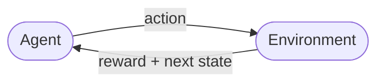

# Reinforcement Learning   (DSAI 402)
## Lecture 1: Why RL

**Prof. Mohamed Ghalwash**  
<Email v="mghalwash@zewailcity.edu.eg" />
_Zewail City University_  

:: note ::

Lecture 1, Monday 21 September 2026

---
layout: top-title
color: sky-light
align: lt
title: Today
---

:: title ::

# Agenda

:: content ::

**Objectives**: you should be able to look at a problem from your own field and say whether an RL formulation fits it.

- Setting: What kind of problem needs RL, and what kind does not? 
- Evidence: Where is RL already used, and how well did it really work? 
- Course: How is this course run, and what does the project ask of you? 

---
layout: top-title
color: light
align: lt
title: Four decisions
---

:: title ::

# Real Applications

:: content ::

| Setting | The decision | When you find out how it went |
|---|---|---|
| An intensive care unit | how much fluid and vasopressor to give this hour | days later, when the patient recovers or does not |
| A game of Go | where to place the next stone | at the end, two hundred moves later |
| A chip floorplan | where to put the next block on the die | after every block is placed and the wires are measured |
| A balloon in the stratosphere | rise or sink to catch a different wind | hours later, from how far it drifted |

Nobody can tell you the correct dose for this patient at 3am, and nobody can label move 37 as right or wrong while the game is still running.

---
layout: top-title
# color: amber-light
align: lt
title: What they share
---

:: title ::

# What These Applications Have in Common

:: content ::

<v-clicks>

- **The feedback scores you. It does not correct you.** You learn that the patient survived. You never learn which dose you should have given instead.

- **The score arrives late.** The move that lost the game may have been played fifty moves before anyone noticed.

- **What you choose changes what you see next.** A balloon that sinks today wakes up tomorrow in a different wind. Your own behavior writes your next training example.

- **You have to try things you are unsure about.** If you only ever repeat what worked before, you never discover the thing that works better.

</v-clicks>

<!--
Ask the room for a fifth example from their own background before moving on.
Engineering students usually offer control problems, business students offer pricing.
-->

---
layout: side-title
side: l
# color: emerald-light
titlewidth: is-4
align: cm-lt
title: The loop
---

:: title ::

# The Loop

Every method in this course is a variation on this picture.

:: content ::

The agent sees the state of the world, picks an action, and the world sends back a number and a new state. Then it happens again.

That is the whole mechanism. The difficulty is not the loop itself. It is that the number arriving now may be the consequence of something the agent did long ago.

---
layout: top-title-two-cols
color: light
columns: is-6
align: l-lt-lt
title: Supervised vs RL
---

:: title ::

# Two Different Jobs

:: left ::

## Supervised learning

You are handed pairs of input and correct answer. The data sits still while you train on it.

A radiologist labels ten thousand chest X-rays. Your model learns to copy the radiologist.

The question is ==what is this?==

Success means matching the label.

:: right ::

## Reinforcement learning

You are handed a world you can act in and a number that scores how it is going.

Nobody labels anything. The agent acts, the world answers, and the answers become the data.

The question is ==what should I do next?==

Success means collecting more reward over time.

---
layout: top-title
color: light
align: lt
title: When not to use RL
---

:: title ::

# When RL is The Wrong Tool

:: content ::

Knowing when not to use a method is part of knowing the method. 

<v-clicks>

- **You already know the right answer for each input.** Then you have labels, so use supervised learning. It is cheaper and far easier to debug.

- **Your decision does not change what comes next.** A single choice with immediate feedback is a bandit problem, and week 2 shows you that a bandit is much simpler than full RL.

- **Mistakes during learning are expensive or dangerous, and you have no simulator.** An agent learns by being wrong thousands of times. Decide where it is allowed to be wrong.

- **You cannot write down a reward you trust.** If nobody can say what a good outcome is, the problem is not ready for RL yet.

</v-clicks>

---
layout: top-title
color: navy-light
align: lt
title: Reward is the specification
---

:: title ::

# The Agent Optimizes What You Wrote

:: content ::

Imagine a cleaning robot rewarded for the amount of dust it collects. A good policy exists that nobody wanted, i.e. knock over the bin and collect the same dust again.

The robot is not broken. It solved the problem you actually posed.

<AdmonitionType type='important'>
Writing the reward is not a preliminary step before the real work. It is most of the work and it is where projects in this course usually go wrong.
</AdmonitionType>

This is one reason every project team needs a mentor from the field the problem comes from. Somebody who has lived with the problem will notice the spilled bin before you do.

<!--
Good moment to mention that week 13 covers RLHF, where writing the reward becomes
learning the reward from human comparisons because nobody can write it down.
-->

---
layout: grid-cards
cols: 4
---

<!-- # Semester Applications Tour -->

:: card-1 ::
#### Article recommendation
- **Action:** which article this visitor sees
- **Reward:** a click

:: card-2 ::
#### Chip floorplanning
- **Action:** where the next block goes on the die
- **Reward:** short wires, low congestion

:: card-3 ::
#### Sepsis treatment 
- **Action:** fluid and vasopressor doses
- **Reward:** patient survival

:: card-4 ::
#### AlphaGo
- **Action:** where the next stone goes
- **Reward:** winning the game

:: card-5 ::
#### TD-Gammon
- **Action:** the next backgammon move
- **Reward:** winning the game

:: card-6 ::
#### Elevator dispatch
- **Action:** which car answers which call
- **Reward:** short waiting time

:: card-7 ::
#### Atari from pixels
- **Action:** a joystick action
- **Reward:** the game score

:: card-8 ::
#### Stratospheric balloons
- **Action:** rise or sink into a new wind
- **Reward:** staying near its station

:: card-9 ::
#### Molecule design
- **Action:** the next fragment of a molecule
- **Reward:** predicted activity

:: card-10 ::
#### Tokamak control
- **Action:** voltages on the control coils
- **Reward:** holding the plasma shape

:: card-11 ::
#### LM alignment
- **Action:** the next token of a reply
- **Reward:** which reply a human preferred
  
---
layout: top-title
color: emerald-light
align: lt
title: The common pattern
---

:: title ::

# What the Successes Have in Common

:: content ::

Look back at the two tables. The wins are not spread evenly across all problems. They cluster where four conditions hold:

1. **The reward can be measured.** A click, a score, a survival flag, a plasma shape. Somebody can compute the number without arguing about it.

2. **Being wrong is cheap or there is a simulator.** Games and simulators let an agent fail a million times for free. The balloon team built a simulator of the stratosphere first.

3. **The decision repeats.** Millions of visitors, thousands of games, one control step every few milliseconds.

4. **There is enough interaction to learn from.** Either a fast environment or a large pile of logged decisions.

When you choose your project problem, check it against these four before you write any code.

---
layout: top-title
color: light
align: lt
title: Summary
---

:: title ::

# What To Take Away

:: content ::

- RL is for problems where the feedback **scores** you instead of correcting you, where the score arrives **late**, and where your own actions decide what data you see next.

- The whole field is one loop: state, action, reward, repeat. The methods differ in how they turn that loop into a better policy.

- The reward function is the specification. An agent that fails is often an agent that succeeded at the wrong thing.

- RL has real wins in medicine, hardware design, aerospace, drug design, plasma physics and language models. It also has a large pile of problems where a simpler method wins, so learn to tell the difference.

Next week: the vocabulary made formal, contextual bandits, and the first paper.

---
layout: top-title
color: sky-light
align: lt
title: Before next week
---

:: title ::

# Before We Meet Again

:: content ::

1. **Read the survey of deployed RL systems** posted on Moodle.

2. **Bring one problem** from outside data science, i.e. a repeating decision that somebody would notice if it were made better. Write one sentence each for the state, the action and the reward. We discuss them at the start of week 2.

3. **Start the mentor conversation now.** Walk over to engineering, aerospace, bioinformatics, business, physics or nanotechnology and ask people which decision annoys them most. The proposal is due in week 4.

<AdmonitionType type='tip'>
A conversation with somebody who has the problem beats a paper search.
</AdmonitionType>

---
layout: section
# color: navy
title: Questions
class: text-center
---

# Learn More

[Course Homepage](https://github.com/m-fakhry/DSAI-402-RL)

