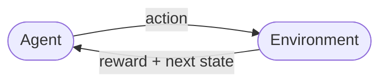

# Reinforcement Learning   (DSAI 402)
## Lecture 2: RL Basics

**Prof. Mohamed Ghalwash**
<Email v="mghalwash@zewailcity.edu.eg" />
_Zewail City University_

:: note ::

Lecture 2, Monday 28 September 2026

---
layout: top-title
color: sky-light
align: lt
title: Today
---

:: title ::

# Agenda

:: content ::

**Objectives**: you should be able to name the state, action, and reward of any repeating decision, and explain why the future matters more than the next step alone.

- Play: a short game, no vocabulary yet
- Name it: agent, environment, state, action, reward
- Formalize it: the loop, return, discounting, the Markov property
- Apply it: the first application paper, contextual bandits for news

---
layout: top-title
color: light
align: lt
title: Play first
---

:: title ::

# The Treasure 3x4 Grid

:: content ::

- The team starts at 🟢. Each turn, pick a direction: **Up / Down / Left / Right**.

- Somewhere on this grid: **one treasure (+10)**, a few **traps (−5)**, everything else is **0**.

- You don't get the map. You only find out what's on a square once you step on it.

- You have 5 moves. The game ends when you reach the treasure or run out of moves.

- Traps cost −5 each time and don't end the game. Hitting the edge wastes a move and scores 0.

| | Col 1 | Col 2 | Col 3 | Col 4 |
|---|---|---|---|---|
| **Row 1** |  |  |  |  |
| **Row 2** | 🟢 |  |  |  |
| **Row 3** |  |  |  |  |

:: note ::

Secret map

| | Col 1 | Col 2 | Col 3 | Col 4 |
|---|---|---|---|---|
| **Row 1** | · | · | · | · |
| **Row 2** | 🟢 | 💥 | · | ⭐ |
| **Row 3** | · | · | 💥 | · |

---
layout: top-title
color: light
align: lt
title: Live scoring
---

:: title ::

# Playing It

:: content ::

| Turn | Path | Landed on |  Running total |
|---|---|---|---|
| 1 | F F R F L| Yes | -5 + 0 + -5  + 0 + 10 | 
| 2 | R F L F F | Yes |  0+ 0 + -5 + 0 + 10 | 
| 3 | F R F F L| Yes |  -5 + 0 + -5 + 0 + 10 | 

<v-click>

How many moves did that take, and what's the final total?

</v-click>

---
layout: top-title
color: light
align: lt
title: Reflect
---

:: title ::

# Debrief

:: content ::

- Each turn, what were you choosing? → a direction

- What did that choice depend on? → your square, how many moves you had left and what you had found so far

- What did you get back after each move? → points — sometimes zero, sometimes not

- What number did you actually care about — one move's points, or your running total? → the running total

- Would it matter if the treasure showed up sooner rather than later? → only because you could run out of moves. The score itself was a plain total.

- Did the squares you visited two turns ago change what you should do now? → yes, because they showed you part of the hidden map. But what a move does still depends only on where you are now.

<!--
Every answer here maps onto a term in the next section: action, state, reward, return, discounting, Markov property.
Don't name the terms yet — let the room describe them in their own words first.
The answers to questions 2 and 6 set up the split made on the Markov property slide. The state is your square and your moves left. What a team found out about the map is learning, not state.
-->

---
layout: side-title
side: l
titlewidth: is-4
align: cm-lt
title: Naming it
---

:: title ::

# You Already Used All Five

Now let's name them properly.

:: content ::

- **Agent** — the thing making decisions
- **Environment** — everything the agent interacts with
- **State** — the situation it's in
- **Action** — the choice it makes
- **Reward** — the feedback it gets back

---
layout: grid-cards
cols: 3
---

# Agent and Environment

:: card-1 ::
#### Agent
The thing making decisions.
- Game: your team
<!-- - News app: the recommendation system -->

:: card-2 ::
#### Environment
Everything the agent interacts with, and reacts to its actions.
- Game: the grid, the traps, the treasure
<!-- - News app: the reader, and whether they click -->

:: card-3 ::
#### State ($S_t$)
The situation at time $t$, i.e. the facts that decide what can happen next.
- Game: your square and how many moves are left
<!-- - News app: the reader's context (device, history, time of day) -->

:: card-4 ::
#### Action ($A_t$)
A choice made in a given state.
- Game: Up / Down / Left / Right
<!-- - News app: which article to show -->

:: card-5 ::
#### Reward ($R_{t+1}$)
The number the environment sends back after action $A_t$.
- Game: +10 treasure, −5 trap, 0 otherwise
<!-- - News app: 1 if clicked, 0 if not -->

:: card-6 ::
<AdmonitionType type='important'>
A reward is feedback on one step, not a verdict on the whole episode. Confusing the two is the most common beginner mistake.
</AdmonitionType>

---
layout: top-title
color: emerald-light
align: lt
title: Putting it together
---

:: title ::

# The Interaction Loop

:: content ::

Start in a state, take an action, get a reward, land in a new state — repeat.

$$
S_0 \xrightarrow{A_0} R_1, S_1 \xrightarrow{A_1} R_2, S_2 \xrightarrow{A_2} R_3, S_3 \; \ldots
$$

This is exactly what teams were doing, turn after turn. Every method in this course is a variation on this loop.

---
layout: top-title-two-cols
color: light
columns: is-6
align: l-lt-lt
title: Two ways to the treasure
---

:: title ::

# Risky Path vs. Safe Path

:: left ::

**Risky — 3 moves**

| | Col 1 | Col 2 | Col 3 | Col 4 |
|---|---|---|---|---|
| **Row 1** | | | | |
| **Row 2** | 🟢 0 | 💥 1 | · 2 | ⭐ 3 |
| **Row 3** | | | | |

Right, Right, Right — straight through the trap.

Reward per step: $-5, 0, +10$

:: right ::

**Safe — 5 moves**

| | Col 1 | Col 2 | Col 3 | Col 4 |
|---|---|---|---|---|
| **Row 1** | 1 | 2 | 3 | 4 |
| **Row 2** | 🟢 0 | · | · | ⭐ 5 |
| **Row 3** | | | | |

Up, Right, Right, Right, Down — around both traps.

Reward per step: $0, 0, 0, 0, +10$

---
layout: top-title
color: light
align: lt
title: The real objective
---

:: title ::

# Return

:: content ::

**Return ($G_t$)**: the total reward collected from time $t$ onward — not just the next step.

$$
G_t = R_{t+1} + R_{t+2} + R_{t+3} + \ldots
$$

- Risky path (through the trap): $-5 + 0 + 10 = 5$
- Safe path (around it): $0 + 0 + 0 + 0 + 10 = 10$

<AdmonitionType type='tip'>
The agent's goal is to maximize <em>return</em>, not any single reward. A tempting +10 now can be a bad idea if it costs you a −20 later.
</AdmonitionType>

---
layout: top-title
color: sky-light
align: lt
title: Sooner is worth more
---

:: title ::

# Discounting

:: content ::

We usually care more about reward that arrives sooner. In the game, sooner only mattered because you could run out of moves. Discounting builds this preference in on purpose.

$$
G_t = R_{t+1} + \gamma R_{t+2} + \gamma^2 R_{t+3} + \ldots, \quad 0 \le \gamma \le 1
$$

<v-clicks>

- $\gamma$ close to 0 → short-sighted: only the next reward really matters
- $\gamma$ close to 1 → far-sighted: future reward counts almost as much as immediate reward
- $\gamma = 1$ only works when the game has an end, like our grid. Otherwise the return can grow without limit.
- Example: two equal +10 treasures, one 2 moves away and one 5 moves away — same raw total, but discounting makes the closer one worth more: $10\gamma$ vs. $10\gamma^4$

</v-clicks>

<AdmonitionType type='important'>

A small reward that comes soon can beat a larger reward that comes late. With $\gamma = 0.9$, +10 after 1 move beats +12 after 10 moves, since $12 \times 0.9^9 \approx 4.6$.
</AdmonitionType>

<!--
The risky and safe paths never flip for any gamma. The safe path is always ahead by 10γ^4 − 10γ^2 + 5, which is at least 2.5. So the grid alone cannot show a flip, and the +10 vs +12 example is needed for that.
-->

---
layout: top-title
color: light
align: lt
title: Why the loop is tractable
---

:: title ::

# Markov Property

:: content ::

To predict what a move does, do you need your whole history, or just your square, your moves left and the move itself?

$$
P(S_{t+1}, R_{t+1} \mid S_t, A_t, S_{t-1}, A_{t-1}, \ldots, S_0, A_0) = P(S_{t+1}, R_{t+1} \mid S_t, A_t)
$$

The current state already summarizes everything relevant from the past. In our grid the state is your square and your moves left. What you found out about the hidden map is not part of the state. Learning the map over many games is the job of the RL algorithm.

<AdmonitionType type='important'>
Most methods in this course lean on this assumption. When it fails, we fix it by putting the parts of the past that matter into the state. For example, DQN (week 10) stacks the last 4 game frames into its state.
</AdmonitionType>

<!--
Monte Carlo methods (week 5) are hurt less when the Markov property fails, because they do not bootstrap (Sutton and Barto, Chapter 5).
-->

---
layout: top-title
color: light
align: lt
title: Formalizing the game
---

:: title ::

# Markov Process

:: content ::

A sequence of states with no actions, where the next state depends only on the current one:

$$
P(S_{t+1} \mid S_t, S_{t-1}, \ldots, S_0) = P(S_{t+1} \mid S_t)
$$

It is described by:

- A set of states $S$
- A transition matrix $P$ (probability of moving from one state to another)

Example: weather, one state per day

`S S R S S S R R S R`

The treasure grid becomes a Markov process once we fix a policy that picks each move from the current state alone and never changes. The teams did not play this way, since they changed plans after each discovery.

<!-- ---
layout: top-title-two-cols
color: light
columns: is-6
align: l-lt-lt
title: Apply it
---

:: title ::

# Paper: News as a Contextual Bandit

:: left ::

Li, Chu, Langford and Schapire (WWW 2010) choose which news story to feature for each visitor on the Yahoo! Front Page.

- **State**: features of the reader and of the candidate stories
- **Action**: which story to show
- **Reward**: 1 if the reader clicks, 0 if not

Their algorithm, which is called LinUCB, was tested offline on over 33 million logged events. It got 12.5% more clicks than a standard bandit that ignores the context.

:: right ::

**Why a bandit and not full RL?**

The story you show does not change who the next reader is. No action sets up a better future, so there is no return to plan for. The best action is the one with the best expected reward right now.

<AdmonitionType type='important'>
The hard part is exploring enough to find that action. Exploration comes back in weeks 5 and 7.
</AdmonitionType> -->

---
layout: top-title
color: light
align: lt
title: Your turn
---

:: title ::

# Practice Check

:: content ::

Identify the agent, environment, state, action, and reward:

**Scenario: a thermostat that learns your comfort preferences**

- It watches the room temperature and time of day
- It can raise or lower the target temperature
- You adjust it back down if it's too warm; you leave it alone if it's comfortable

<v-click>

*2 minutes — then we compare answers*

</v-click>

---
layout: grid-cards
cols: 4
---

:: card-1 ::
#### Agent
The decision-maker

:: card-2 ::
#### Environment
Everything it interacts with

:: card-3 ::
#### State $S_t$
The situation at time $t$

:: card-4 ::
#### Action $A_t$
A choice made in a state

:: card-5 ::
#### Reward $R_{t+1}$
Feedback after one step

:: card-6 ::
#### Return $G_t$
Total reward from now on

:: card-7 ::
#### Discount $\gamma$
How much future reward is worth today

:: card-8 ::
#### Markov property
The state summarizes the past

---
layout: top-title
color: sky-light
align: lt
title: Before next week
---

:: title ::

# Before We Meet Again

:: content ::

1. **Write a short response to the Li et al. paper** — see Assignment 2 for the exact prompt.
2. **Identify agent, state, action, reward** for a problem of your choice.
3. Next lecture: the Markov Decision Process — policy, value functions, Bellman equations, and the chip-floorplanning paper.

<AdmonitionType type='tip'>
If you're stuck naming the state for your project idea, that's normal — it's usually the hardest part to get right, and it's exactly what week 3 gives you tools for.
</AdmonitionType>

---
layout: section
title: Questions
class: text-center
---

# Learn More

[Course Homepage](https://github.com/m-fakhry/DSAI-402-RL)